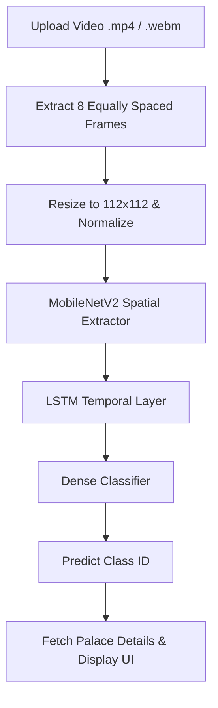

# 🏰 Signs of the Palace

[](https://www.python.org/)
[](https://www.tensorflow.org/)
[](https://flask.palletsprojects.com/)
[](https://opencv.org/)
[](LICENSE)

**Signs of the Palace** is an innovative AI-driven deep learning project designed to preserve, interpret, and showcase the unique sign language vocabulary associated with the cultural heritage, history, and artifacts of the **Mysore Palace**. 

By bridging the gap between technology and cultural preservation, this system makes historical heritage accessible to everyone—specifically the hearing-impaired community and history enthusiasts.

---

## 🌟 Key Features

- **🎥 Real-Time Sign Recognition**: Upload short sign language gestures (`.mp4`, `.webm`) and get instant classification.
- **🏛️ Cultural Heritage Educational Portal**: After predicting a sign, the application displays a detailed history and explanation of the classified palace asset.
- **🧠 CNN + LSTM Architecture**: Employs spatial feature extraction using **MobileNetV2** combined with temporal sequence modeling using **LSTM** for spatio-temporal learning.
- **📂 Robust Dataset**: Built and trained on a custom-augmented dataset containing **over 2,000 video clips** representing 29 unique classes.
- **📧 Built-in Contact System**: Users can send inquiries or feedback directly to project administrators via secure Gmail SMTP integration.
- **💻 Responsive Premium Glassmorphism UI**: Beautiful, interactive interface with smooth animations, dark-themed styling, and seamless user experience.

---

## 🏗️ System Architecture & Workflow

The system processes video files into sequence inputs and makes classification decisions using a deep learning pipeline:



### 🧠 Model Details
1. **Spatial Features (CNN)**: Features are extracted using a pre-trained **MobileNetV2** (fine-tuned by leaving the top 20 layers trainable), wrapped in Keras's `TimeDistributed` wrapper.
2. **Temporal Dynamics (LSTM)**: A 128-unit Long Short-Term Memory network processes the temporal sequence of spatial embeddings across the 8 frames.
3. **Classification**: Dense layer with Dropout (`0.3` to `0.5`) mapping to 29 softmax output units.

---

## 📂 Dataset Classes (29 Categories)

The model is trained to recognize 29 specific items, landmarks, figures, and artifacts from the Mysore Palace:

| Category | Description | Category | Description |
| :--- | :--- | :--- | :--- |
| **Mysore Palace** | The grand royal residence | **Ambari** | Golden Howdah elephant seat |
| **King Crown** | Royal Raja Mudi coronation crown | **Sword** | Historical swords/armour |
| **Elephant** | Procession and ceremonial symbols | **Horse** | Cavalry and carriage horses |
| **Soldiers** | Palace infantry & Lancers | **Queen** | Historical Maharanis of Mysore |
| **Minister (Mantri)**| Historic Dewans (e.g. Purnaiah) | **King's Throne** | The majestic Golden Throne |
| **Crossbow** | Ranged palace weapons | **Shield** | Ornate combat/ceremonial shields |
| **Pillars** | Ornate Durbar Hall structure | **Mace** | Traditional Gada weapon |
| **Canon** | Ceremonial saluting cannons | **Temples** | Sacred spaces inside the complex |
| **Main Door** | Intricate rosewood entrance gate | **North Gate** | Balarama-Jayarama Gateway |
| **South Gate** | Varaha Gate for visitors | **Kalyana Mantap**| Octagonal royal wedding hall |
| **Chamundeshwari** | Goddess Murthy deity | **Paintings** | Gold-leaf Mysore art style |
| **Javelin Throw** | Lance skills of cavalry | **Flag** | Gandaberunda royal emblem flag |
| **Ambulance Carriage**| Vintage royal medical transport | **Queen Dressing Room**| Temperature-controlled private room |
| **Chamundeshwari Temple**| Historic temple on hill summit | **Palace Gate** | East Gate (Elephant Gate) |
| **King Suit / Peta** | Traditional royal court attire | | |

---

## ⚙️ Project Structure

```
├── app.py                      # Main Flask Web Application
├── config.py                   # Secure Configuration (SMTP credentials)
├── descriptions.py             # Custom historical descriptions for the 29 classes
├── class_names.pkl             # Serialized list of classification labels
├── train model.py              # Script to build and train the CNN + LSTM model
├── predict video.py            # Local command-line verification script
├── make pickle.py              # Helper script to create class labels pickle
├── extracting frames.py        # Frame preprocessing & dataset builder script
├── sign_language_model_augmented.keras # Trained Tensorflow model
├── train_augmented/            # Directory containing organized video dataset
├── static/
│   ├── css/                    # Custom stylesheets (glassmorphism theme)
│   └── uploads/                # Directory for uploaded videos & extracted frames
└── templates/                  # Jinja2 HTML Templates
    ├── layout.html             # Base HTML template (Header, Footer, Navigation)
    ├── index.html              # Landing page
    ├── home.html               # Project home / intro
    ├── predict.html            # Upload and result prediction page
    ├── about_palace.html       # Palace history page
    ├── about_project.html      # Project details page
    └── contact.html            # Contact & Feedback Form
```

---

## 🚀 Getting Started

### 📋 Prerequisites

Ensure you have Python 3.8+ installed on your system. 

```bash
# Verify Python version
python --version
```

### 🔧 Installation

1. **Clone the Repository**:
   ```bash
   git clone https://github.com/your-username/signs-of-the-palace.git
   cd signs-of-the-palace
   ```

2. **Install Dependencies**:
   Ensure you have the required packages. You can install them via pip:
   ```bash
   pip install tensorflow numpy opencv-python scikit-learn flask
   ```

3. **Configure Mail Settings**:
   Create or edit the `config.py` file in the root directory to enable contact notifications:
   ```python
   # config.py
   EMAIL_USER = "your-gmail@gmail.com"
   EMAIL_PASS = "your-app-password"  # Use Google App Passwords
   TARGET_EMAIL = "admin-email@gmail.com"
   ```

### ⚡ Running the Web App

Start the Flask server locally:
```bash
python app.py
```
Open [http://127.0.0.1:5000](http://127.0.0.1:5000) in your browser to experience the application.

---

## 🏋️ Model Training & Custom Data Preprocessing

If you want to retrain the model on new sign language gestures:

1. **Organize your Dataset**:
   Place video clips under `train_augmented/<class_name>/`.
2. **Re-generate Class Labels**:
   ```bash
   python "make pickle.py"
   ```
3. **Train the Model**:
   ```bash
   python "train model.py"
   ```
   This will train the MobileNetV2 + LSTM model, save weights to `sign_language_model_augmented.keras`, and export validation stats.

---

## 📝 License

This project is licensed under the MIT License - see the [LICENSE](LICENSE) file for details.

---

## 🤝 Acknowledgements

- Historical records and image/gesture data references inspired by **Mysore Palace Board** & **Wadiyar Dynasty** history.
- Built using open-source tools: TensorFlow, OpenCV, and Flask.
